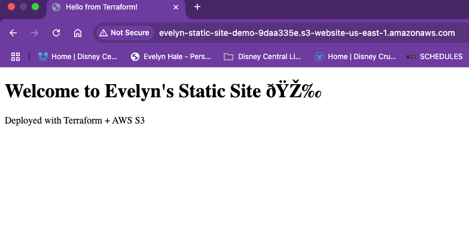

# ☁️ Terraform S3 Static Website

This project uses **Terraform** to deploy a fully public static website on **AWS S3**.

---

## 🚀 What It Does
- Creates an S3 bucket with a unique name
- Configures it for static website hosting
- Uploads an HTML file
- Applies the necessary public access policy

---

## 🌐 Live Demo

🔗 [Visit the live site here](http://evelyn-static-site-demo-9daa335e.s3-website-us-east-1.amazonaws.com)
---

## 📸 Screenshot

---

## 🧠 What I Learned

- How to define infrastructure as code using Terraform
- Automate the deployment of AWS S3 buckets
- Work with bucket policies and static site configuration
- Understand `terraform init`, `apply`, and `destroy`

---

## 🧰 Tools Used

- Terraform
- AWS S3
- Git + GitHub
- macOS Terminal

---

## 📂 File Structure

terraform-s3-static-site/
├── index.html
├── main.tf
├── README.md
├── screenshot.png
└── .gitignore
---

## 🤝 Connect With Me

Let’s build together!  
📧 evelynhale0424@yahoo.com  
🌐 [LinkedIn Profile](https://linkedin.com/in/evelyn-hale-a97080186/)

